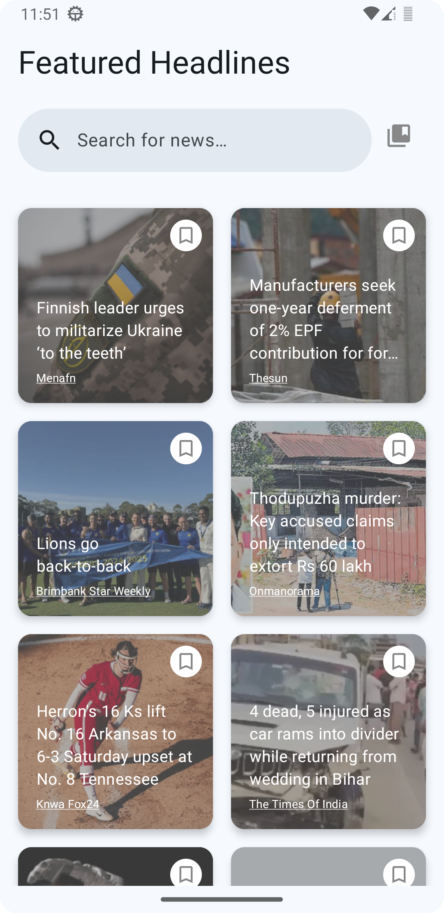
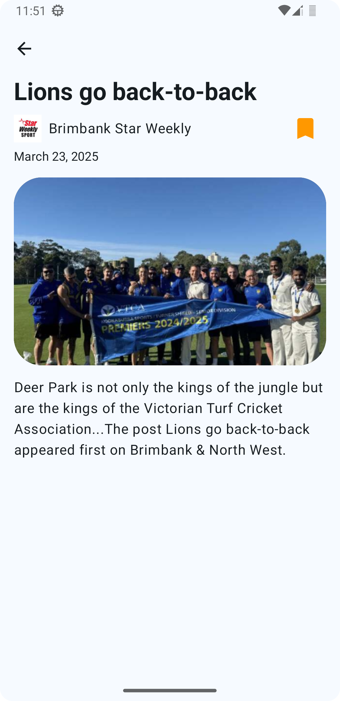
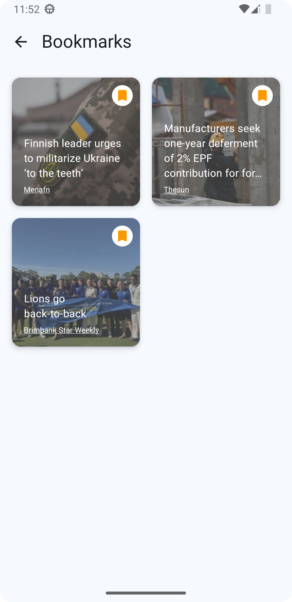

# News Compose

News Compose is an Android application that is made with Modern Android Development tools/technology. Users can browse the news feed with pagination, can search for news with keywords, and can bookmark the news which can be accessed on the Bookmarks screen. 

<p align="center">
  
  
  
</p>

## Setup

1. **Clone the repository:**

    ```
    git clone https://github.com/ralphevmanzano/news-compose.git
    cd news-compose
    ```

2. **Create a `secrets.properties` file:**

    In the root directory of the project, create a file named `secrets.properties` and add your API key from https://newsdata.io/:

    ```properties
    NEWS_API_KEY=your_api_key_here
    ```

3. **Open the project in Android Studio:**

    Open Android Studio and select `Open an existing project`. Navigate to the cloned repository and open it.

4. **Build the project:**

    Sync the project with Gradle files and build the project to ensure all dependencies are downloaded.

## Coding Challenge Details
1. The app now uses the [newsdata.io](https://newsdata.io/) API instead of [newsdatahub.com](https://newsdatahub.com/), as my account was locked after exceeding the API request limit. Both APIs function similarly, so this change shouldn't cause any issues.
2. The app treats the News Feed as the **featured headlines**,
3. Featured Indicator (sparkle icon) **ONLY shows on search results**. (eg. Search for news which are visible on news feed/news list screen)
4. Users can bookmark any news anywhere in the app (news feed/news list screen, bookmarks screen, news details screen), the app stores the bookmarked news in a local database using Room (I know it's not required but I did did it anyway to also showcase how I would architect the app with local database)
5. The app can **ONLY load 10 items per page** as this is a limitation of the free pricing plan of the API
6. Unit Test cases are also added for the ViewModels.

## Architecture
The project follows **Clean Architecture** principles and implements **MVVM (Model-View-ViewModel)** to ensure a well-structured, maintainable, and testable codebase. It also employs the **Repository Pattern** and **Use Cases** to manage data and business logic efficiently.  

1. **Data Layer** → Retrieves data from **local (database) or remote (API) sources**. The **Repository** abstracts these sources and provides a single source of truth.  
2. **Domain Layer** → Contains **Use Cases**, which encapsulate business logic and process data before passing it forward.  
3. **Presentation Layer (MVVM)** → **ViewModels** interact with **Use Cases**, exposing data to the UI via **StateFlow/SharedFlow**.  

This structured approach enhances scalability, testability, and maintainability, reducing dependencies between layers. 🚀

## Tech-Stack

- **Kotlin:** The primary programming language used for the development of the app.
- **Jetpack Compose:** A modern toolkit for building native Android UI.
- **Koin:** A smart Kotlin Dependency injection library.
- **Room** For local database.
- **Coroutines:** For managing background threads and performing asynchronous operations.
- **Flow:** For handling streams of data asynchronously.
- **Retrofit:** For making network requests.
- **MockK:** For mocking dependencies in unit tests.
- **JUnit:** For writing and running unit tests.
